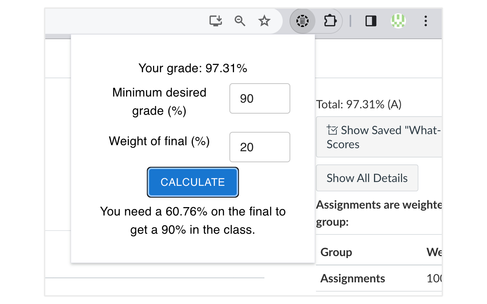

#  Canvas Final Grade Calculator

Web extension that automatically fetches Canvas class grade and calculates the required score on your final exam to receive your desired grade.

    

## Setup

[Install](https://nodejs.org/en/download) Node.js 20 \
Confirm installation by running `node --version` in the command line.

To add to Google Chrome locally,

1. Navigate to `chrome://extensions` in the browser
2. Enable developer mode
3. Click `manage extensions`
4. Click `load unpacked`
5. Select the `dist` directory

## Available Scripts

### `npm run build`

Creates a production-ready version of your project.

### `npm install`

Installs all packages listed in the `package.json` file in the directory you are in.

### `npm run format`

Formats all code using Prettier. \
In VS Code, you can install the plugin [Prettier - Code formatter](https://marketplace.visualstudio.com/items?itemName=esbenp.prettier-vscode) to format code automatically when saving a file.
